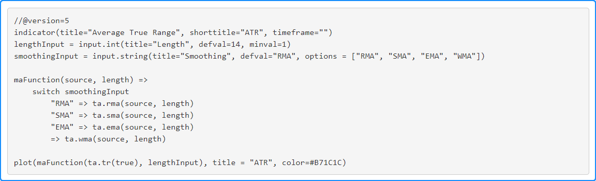
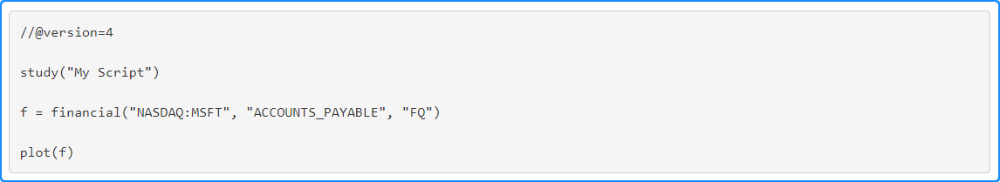
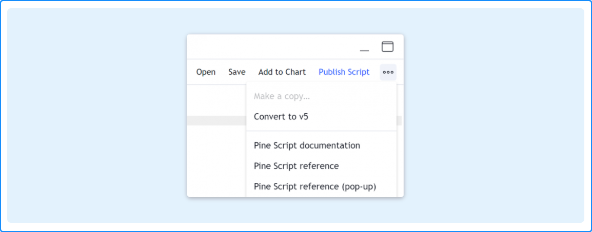
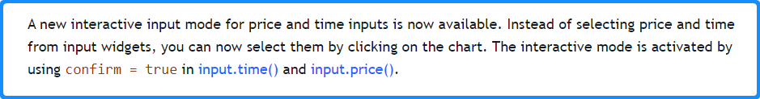

# Writing Guidelines for Pine-Related Blog Posts


### Table of Contents

- [Introduction](#introduction)
- [Structure](#structure)
  - [Lead Image](#lead-image)
  - [Code Examples](#code-examples)
  - [Closing Paragraphs](#closing-paragraphs)
  - [Screenshots](#screenshots)
- [Writing Style](#writing-style)
- [Process](#process)
- [Typographic Conventions](#typographic-conventions)
  - [Pine Keywords](#pine-keywords)
  - [Inline Code](#inline-code)
  - [Block Code](#block-code)
  - [Capitalization of Titles](#capitalization-of-titles)
  - [UI Component Names](#ui-component-names)
  - [Double Quotation Marks](#double-quotation-marks)
  - [Bold](#bold)
  - [Italics](#italics)
  - [Em dash](#em-dash)
- [Examples](#examples)


## Introduction

This page documents how we produce Pine-related blog posts. We'll start by looking at the structure of our posts, then see how to create them.

Blog posts are a critical component of our communications with Pine coders. Script users can also often benefit from our Pine-related blog posts, which considerably increases their audience. When done properly, our blog posts reflect the professionalism of our teams and do their part to promote optimal perception of TradingView by our users. What we say and how we say it are both important.

Blog posts should be well-planned and coordinated with the rollout of the feature. Many people must contribute to make great posts. Their work requires time; we must ensure they have enough of it to do their work properly.


## Structure

Our blog posts use the following stucture:

1. A **lead image** in the top-left corner.
1. A **catchy title** (ask help from James and Laurie if needed).
1. A **short introductory paragraph** (two or three sentences) summarizing the new feature AND mentioning its most important impact from a user's point of view.
1. One or more **sub-sections** explaining how to use the feature, with a script example and a screenshot for each sub-section, if needed.
1. When possible, **links to script publications** using the new feature should be included.
3. Our standard [closing paragraphs](#closing-paragraphs).
4. The "What's new" **notification text** to be used for the blog post.


### Lead Image
Veniamin does the lead image, but we should help him out by either providing a screenshot for it, or asking him to design a custom graphic. 
Make sure he has enough time to do his thing. This is an example of a lead image:


### Code Examples

Our code examples should:

- Follow the recommendations from our [Style guide](https://www.tradingview.com/pine-script-docs/en/v5/writing/Style_guide.html).
- Ideally demonstrate something that can be of practical use to traders, as opposed to code merely illustrating the feature and not useful in a trading context.
- Favor readability over conciseness.
- Be complete, i.e., compilable. If a full demonstration would require an inordinately long script, then we can use only the relevant code lines.

This is good example code:



This is a code example that could have been better. Something more useful to traders could have been coded here while keeping the example short:




### Closing Paragraphs

We use the following text to close all blog posts:

> To stay informed of new Pine Script™ features, keep an eye on the User Manual's [Release notes](https://www.tradingview.com/pine-script-docs/en/v5/Release_notes.html).
  The [PineCoders](https://www.tradingview.com/u/PineCoders/) account also broadcasts updates from its [Squawk Box](https://t.me/PineCodersSquawkBox) on Telegram, 
  its [Twitter account](https://twitter.com/PineCoders), and from the "Pine Script™ Q&A" public chat on TradingView.
>  
> We hope you find this highly-requested feature as useful as we think it’ll be, and please do keep sending us your feedback and suggestions so we can make the platform the best it can be. We build TradingView for you, and we’re always keen to hear your thoughts.

You can pick up the standard text to paste it in your blog post from [this doc](https://docs.google.com/document/d/1PUtJFrLIkYmUKwIwmxwqX0JipjFVek6Qs20QiXuQK98/edit?usp=sharing).


### Screenshots
- Structure your screenshots carefully so the focus is on what you want to demonstrate. 
  Remove all unnecessary content from the screen before taking the screenshot, including any personal information.
- If you show the name of your chart layout in the screenshot, make sure its name is "TV" or "TradingView".
- **Screenshots should always have an even number of pixels in both dimensions**; they will look sharper when rescaled.
- Veniamin will usually add a frame around screenshots, so be sure to ping him when you post them.
  This is particularly important for square screenshots of a dialog box, for example, as they would be too large in the published page without a proper frame. 
  Such screenshots must be artifically framed to achieve a correct x:y ratio.
- Consider using an animated GIF if it demonstrates the feature more effectively.
- Veniamin has a pinned post in the "blog" channel explaining how to make optimal screenshots.

This is an example of a dialog box screenshot that has been properly scaled:




## Writing Style

Focus on what's in it for users: what they can do with the new feature, and how.

Our writing style should emulate the casual style created by James that has become our trademark: no frills, no bs, engaging, sometimes humorous, and to the point. If you are unsure, ask for help from Tagatha.

Unless otherwise specified, we use U.S. English style and spelling standards.


## Process

- Although it's not a requirement, it's useful for users if we can include links to published scripts using the feature. 
  This entails that we coordinate with PineCoders and give them at least a week to come up with worthwhile example scripts.
- If you cannot think of useful code examples, ask PineCoders in one of the PineCoders rooms, or Luc.
- Warn Alexander ahead of time and plan an approximate publishing date with him. 
  Some periods are busier than others and there is a limit to the frequency of blog post publications.
- Write a first draft of your post and share it with Luc so he can review it.
- Ask Tagatha to review the post's text. She keeps a spreadsheet to track requests: 
  [TradingView: Edits tracker](https://docs.google.com/spreadsheets/d/1sNC7AuV1T3fafiXeM-YLASXi-j2uXOvGSslMPRbOpc8/edit#gid=0). 
  Make an entry in it for your post.
- Ask Veniamin to do the lead image and the screenshots that will appear in the post.
- When you are satisfied with the post, let Alexander know.


## Typographic Conventions


### Pine Keywords

Whenever we use a Pine keyword that has an entry in the Reference Manual, we link it to its entry, which accomplishes two things:
- It helps readers by providing easy access to the Reference Manual.
- It formats the keyword in blue, which makes it stand out.

Also:
- Always use ``()`` to suffix function names, e.g., [math.ceil()](https://www.tradingview.com/pine-script-reference/v5/#fun_math{dot}ceil).
- When referring to a family of functions, such as ``array.*()``, use [inline code](#inline-code) markup.

Use the standard linking feature in Google docs to mark up keywords; the links will be preserved in the post. Linked keywords will look like this in the published posts:




### Inline Code

We use backticks to wrap inline code when it is not a keyword that can be linked to Reference Manual entry, e.g.:
> Use the ```confirm``` parameter to...  
  Our ```if barstate``` line...  
  The ``request.*()`` functions fetch data from other contexts than the chart's.

Text wrapped in backticks will be converted to monospace by Alexander:


### Block Code

We format block code in a monospace font in the Google doc.


### Capitalization of Titles

Contrary to our [Writing Guidelines for the Pine User Manual](https://github.com/tradingview/documentation-guidelines/tree/main/PineUserManual), we capitalize titles in blog posts. You can use a tool like [Capitalize My Title](https://capitalizemytitle.com/) to produce correctly capitalized titles.


### UI Component Names

We wrap UI component names in double quotes, e.g.:
> Use the "Settings" dialog box to modify the script's inputs, visual attributes, or visiblity.  
> Users of your script can change its input values with the "Settings/Inputs" tab.  
> You can load scripts on your chart with the "Indicators & Strategies" button situated above the chart.  
> Scripts define alert events; actual alerts must be created using the chart's "Create Alert" dialog box.  


### Double Quotation Marks

As stated in the previous section, we use double quotes for UI component names, and when referring to:
- The title of a publication on TradingView or elsewhere, as in:
  > The "CAGR" indicator...
- Form-type pairs, or forms, or types (see the ["Forms and types" section of the RST Guidelines](https://github.com/tradingview/documentation-guidelines/blob/main/PineUserManual/RSTGuidelines.md#forms-and-types)).


### Bold

We use bold to indicate emphasis, e.g.:
> This line must be the **last** one in the local block.


### Italics

We use italics when introducing concepts, e.g.:
> [...] where "const" is considered a *weaker* form than "input", for example, and "series" *stronger* than "simple".


### Em dash

Contrary to standard practices in English, we use a space on each side of Em dashes. 
The EM dash is not very wide in the Trebuchet MS font used in blog posts; the spaces on each side make them more prominent:
> Providing a selection of color presets in your inputs — rather than a single color that can be changed — can help color-challenged users. 

Note that the Em dash (—) is not a normal dash (-); it is U+2014.


## Examples

- [Pine Scripts Are Now Interactive](https://www.tradingview.com/blog/en/pine-scripts-are-now-interactive-27147/)
- [Say Hello to Pine Script v5](https://www.tradingview.com/blog/en/say-hello-to-pine-script-v5-26900/)
