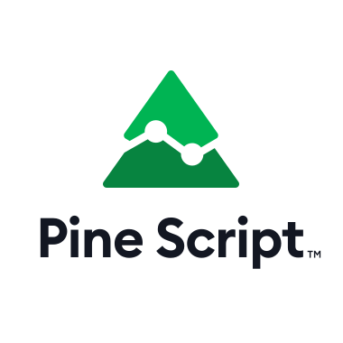

# Instructions

The `.svg` vector file should be used whenever we can.

If you use the `.png` bitmap files, try to use them unscaled. 
A few different sizes are available. **If you scale them, please try to use integer multiples.** 
For example, we use the `PineScript logo 960x960.png` in the usrman's intro page at 240x240, which is a 4:1 scale.
